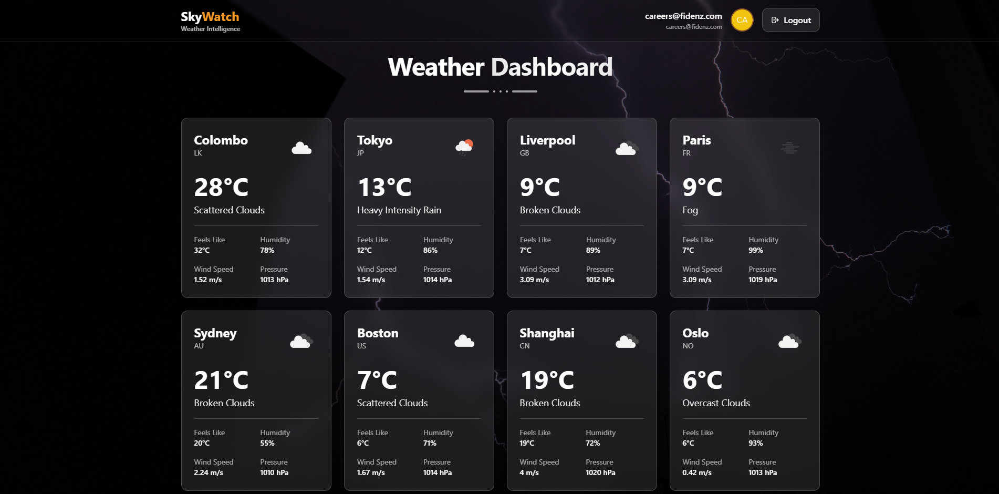
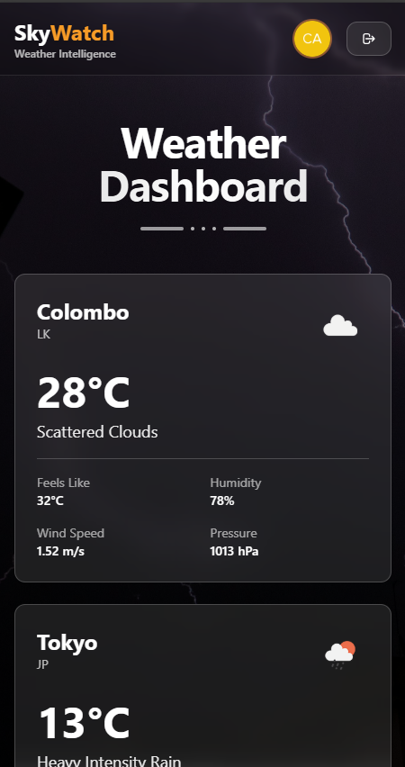

# ☀️ SkyWatch 

A full-stack weather application with Auth0 authentication, built with React, TypeScript, Node.js, and Express.

## ✨ Features

- 🔐 **Auth0 Authentication** - Secure login with MFA (Multi-Factor Authentication)
- 🌤️ **Real-time Weather Data** - Fetches live weather information from OpenWeatherMap API
- 💾 **Smart Caching** - 5-minute cache to optimize API calls
- 📱 **Responsive Design** - Works seamlessly on desktop and mobile devices
- 🎨 **Modern UI** - Beautiful gradient design with glassmorphism effects
- 🔒 **JWT Authorization** - Protected API endpoints with token validation
- 🚀 **TypeScript** - Full type safety across frontend and backend

## 🛠️ Tech Stack

### Frontend
- React 18 with TypeScript
- Auth0 React SDK
- Axios for API calls
- Tailwind CSS for styling

### Backend
- Node.js with Express
- TypeScript
- Auth0 JWT verification
- Node-cache for response caching
- OpenWeatherMap API integration

## 📦 Prerequisites

Before you begin, ensure you have the following installed:

- **Node.js** (v16 or higher) - [Download](https://nodejs.org/)
- **npm** (comes with Node.js)
- **Git** - [Download](https://git-scm.com/)

You'll also need accounts for:
- **Auth0** - [Sign up](https://auth0.com/signup)
- **OpenWeatherMap** - [Sign up](https://openweathermap.org/appid)

## 🚀 Installation

### 1. Clone the Repository

```bash
git clone https://github.com/ShashiniMadhu/weather-app.git
cd weather-app
```

### 2. Install Backend Dependencies

```bash
cd backend
npm install
```

### 3. Install Frontend Dependencies

```bash
cd ../frontend
npm install
```

## ⚙️ Configuration

### Step 1: Auth0 Setup

#### Create Auth0 Account
1. Go to [Auth0](https://auth0.com) and sign up
2. Create a new tenant (e.g., `your-name-weather`)

#### Create API
1. Navigate to **Applications** → **APIs**
2. Click **"+ Create API"**
3. Fill in:
   - **Name**: `Weather API`
   - **Identifier**: `https://weather-api.fidenz.com`
   - **Signing Algorithm**: `RS256`
4. Click **"Create"**

#### Create Application
1. Navigate to **Applications** → **Applications**
2. Click **"+ Create Application"**
3. Fill in:
   - **Name**: `Weather App`
   - **Type**: `Single Page Web Applications`
4. Click **"Create"**
5. Go to **Settings** tab and configure:
   - **Allowed Callback URLs**: `http://localhost:3000`
   - **Allowed Logout URLs**: `http://localhost:3000`
   - **Allowed Web Origins**: `http://localhost:3000`
   - **Allowed Origins (CORS)**: `http://localhost:3000`
6. Click **"Save Changes"**
7. Go to **APIs** tab and authorize **Weather API**

#### Enable MFA (Multi-Factor Authentication)
1. Navigate to **Security** → **Multi-factor Auth**
2. Enable **Email** as a factor

#### Disable Public Signups
1. Navigate to **Authentication** → **Database**
2. Click on **Username-Password-Authentication**
3. Go to **Settings** tab
4. Toggle **"Disable Sign Ups"** to ON
5. Click **"Save"**

#### Create Test User
1. Navigate to **User Management** → **Users**
2. Click **"+ Create User"**
3. Fill in:
   - **Email**: `careers@fidenz.com`
   - **Password**: `Pass#fidenz`
   - **Connection**: `Username-Password-Authentication`
4. Click **"Create"**

### Step 2: OpenWeatherMap API Key

1. Go to [OpenWeatherMap](https://openweathermap.org/api)
2. Sign up and navigate to **API Keys**
3. Copy your API key (wait 10-15 minutes for activation)

### Step 3: Environment Variables

#### Backend Configuration

Create a `.env` file in the `backend` folder:

```bash
cd backend
# Create .env file
```

Add the following content to `backend/.env`:

```env
PORT=5000
OPENWEATHER_API_KEY=your_openweathermap_api_key
AUTH0_AUDIENCE=https://weather-api.fidenz.com
AUTH0_ISSUER_BASE_URL=https://your-tenant.us.auth0.com
NODE_ENV=development
```

**Replace:**
- `your_openweathermap_api_key` - Your OpenWeatherMap API key
- `your-tenant.us.auth0.com` - Your Auth0 domain (from Application Settings)

#### Frontend Configuration

Create a `.env` file in the `frontend` folder:

```bash
cd ../frontend
# Create .env file
```

Add the following content to `frontend/.env`:

```env
REACT_APP_AUTH0_DOMAIN=your-tenant.us.auth0.com
REACT_APP_AUTH0_CLIENT_ID=your_auth0_client_id
REACT_APP_AUTH0_AUDIENCE=https://weather-api.fidenz.com
REACT_APP_API_URL=http://localhost:5000/api
```

**Replace:**
- `your-tenant.us.auth0.com` - Your Auth0 domain (from Application Settings)
- `your_auth0_client_id` - Your Auth0 Client ID (from Application Settings)

### Environment Variables Reference

| Variable | Description | Where to Find |
|----------|-------------|---------------|
| `OPENWEATHER_API_KEY` | OpenWeatherMap API Key | OpenWeatherMap → Account → API Keys |
| `AUTH0_DOMAIN` | Auth0 Tenant Domain | Auth0 → Applications → Your App → Settings → Domain |
| `AUTH0_CLIENT_ID` | Auth0 Application Client ID | Auth0 → Applications → Your App → Settings → Client ID |
| `AUTH0_AUDIENCE` | Auth0 API Identifier | Auth0 → Applications → APIs → Your API → Settings → Identifier |
| `AUTH0_ISSUER_BASE_URL` | Auth0 Domain with https:// | `https://` + Your Auth0 Domain |

## 🏃 Running the Application

### Start Backend Server

```bash
cd backend
npm run dev
```

Backend will run on: **http://localhost:5000**

You should see:
```
🚀 Server is running on port 5000
📍 Health check: http://localhost:5000/health
```

### Start Frontend Application

Open a new terminal:

```bash
cd frontend
npm start
```

Frontend will run on: **http://localhost:3000**

The browser will automatically open the application.

## 🧪 Testing

### Test Credentials

- **Email**: `careers@fidenz.com`
- **Password**: `Pass#fidenz`

### Test Flow

1. Open http://localhost:3000
2. Click **"Sign In with Auth0"**
3. Login with test credentials
4. Complete MFA verification (check email)
5. View weather dashboard with real-time data

### API Endpoints

#### Public Endpoints
- `GET /health` - Health check
- `GET /api/cities` - Get list of cities

#### Protected Endpoints (Requires Authentication)
- `GET /api/weather` - Get weather data for all cities
- `GET /api/weather/:cityCode` - Get weather data for specific city

### Testing API with cURL

```bash
# Health check
curl http://localhost:5000/health

# Get cities list
curl http://localhost:5000/api/cities

# Get weather (requires valid JWT token)
curl -H "Authorization: Bearer YOUR_JWT_TOKEN" http://localhost:5000/api/weather
```
## 📸 Screenshots

### Login Page


### Weather Dashboard - Desktop View


### Weather Dashboard - Mobile View


## 👨‍💻 Developer

**Shashini Madhushika**

- GitHub: [@ShashiniMadhu](https://github.com/ShashiniMadhu)
- Repository: [weather-app](https://github.com/ShashiniMadhu/weather-app)

---

**Built with ❤️ using React, Node.js, TypeScript, and Auth0**
